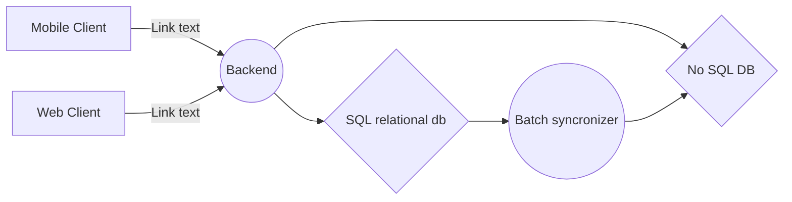

# Delivery Project Doc

Hi! I'm your first Markdown file in **StackEdit**. If you want to learn about StackEdit, you can read me. If you want to play with Markdown, you can edit me. Once you have finished with me, you can create new files by opening the **file explorer** on the left corner of the navigation bar.


# Architecture


# Project Structure

## Entity
## repository
## DTO
## Handler
## Service
## Exception
## APi


## UML diagrams

global architecure

Sequence diagram arch
```mermaid
sequenceDiagram
Client->> Backend: add_customer
Backend->>SQL: save_user() 
Backend->>NOSQL: save_user() 